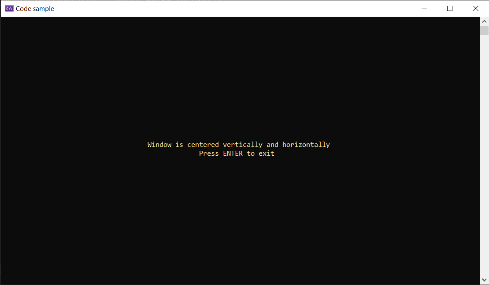
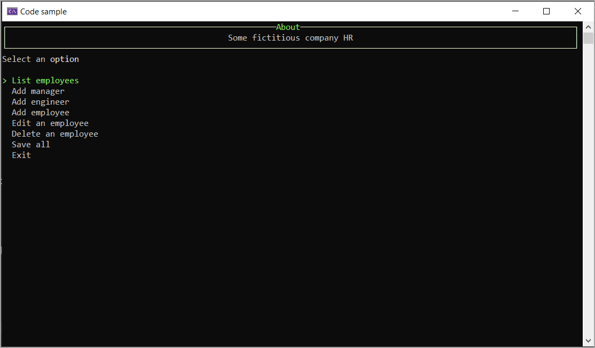

# About

Various helpers for creating console projects from NuGet package [ConsoleHelperLibrary](https://www.nuget.org/packages/ConsoleHelperLibrary/).

Main reason for this library is for positioning console windows.

Although its possible to resize a window its not portable to other operating system than Windows.

```csharp
Console.SetWindowSize(40, 10);
```

Other methods like center text in a window and timeout ReadLine came from various forum questions.

> **Note**
> Example projects have a GlobalUsings file for using aliases.

## Center screen/Center text



## Menu example



## See also

[Spectre.Console](https://spectreconsole.net/) is a .NET library that makes it easier to create beautiful console applications.